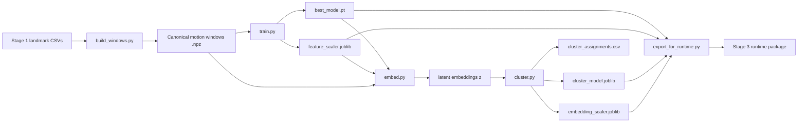
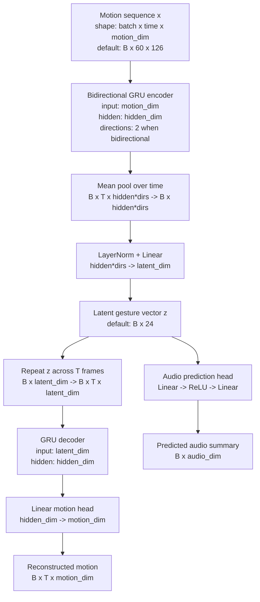

# AV-GRU Autoencoder Model and Flow


## Purpose

This Stage 2 package turns Stage 1 hand-landmark CSVs into fixed-length motion windows, trains a GRU autoencoder, converts each window into a compact latent gesture vector, clusters those latent vectors, and exports the trained artifacts for Stage 3 runtime use.

The most important design point is that the encoder input is motion only. Audio is used as an optional auxiliary training target, gated by each window's `audio_quality` value. This means the deployed runtime can operate from camera/MediaPipe hand landmarks without needing live audio features.

## End-to-End Flow



## Model Architecture



## Data Contract

The default motion feature vector is a two-hand MediaPipe representation:

```text
right hand 63 values + left hand 63 values = 126 motion features
```

Each hand has 21 landmarks, each with 3 coordinates, so one hand contributes 63 values. The builder uses handedness labels when available, so the model input is always ordered as right hand followed by left hand rather than whatever order MediaPipe detected in a frame. Missing hands are filled with zeros.

By default, each hand vector is normalized before windowing:

- The wrist landmark is subtracted, so coordinates are local to the hand.
- The hand is scaled by the distance to landmark 9.
- Values are converted to `float32`.
- Optional velocity features can be appended, but the shipped default configs keep `include_velocity: false`.

The window builder writes `.npz` files containing:

- `motion`: fixed sequence of shape `[sequence_length, motion_dim]`.
- `audio`: audio summary vector, either placeholder or real features.
- `audio_quality`: scalar gate for the audio loss.
- Metadata such as source CSV/video, frame range, timestamps, and a serialized feature contract.

The common default configuration uses `sequence_length: 60`, `motion_dim: 126`, and `audio_dim: 12`. The small and motion-only configs use `audio_dim: 1` placeholders and set the audio loss weight to zero.

## Forward Pass

For a batch of motion windows, the forward pass does four things:

1. Encode the motion sequence with a GRU.
2. Pool the encoded sequence across time to make one sequence-level summary.
3. Project that summary to the latent gesture vector `z`.
4. Decode `z` back into a motion sequence while also predicting an audio summary from `z`.

The encoder is a PyTorch `nn.GRU` with `batch_first=True`. If `bidirectional` is enabled, each time step produces a concatenated forward/backward hidden state. The code does not use the final hidden state directly. Instead, it averages the GRU output across all time steps:

```text
encoder output: B x T x (hidden_dim * num_directions)
mean pooled:    B x (hidden_dim * num_directions)
latent z:       B x latent_dim
```

The decoder receives the same latent vector at every reconstructed time step. In other words, the decoder is conditioned on a repeated sequence:

```text
z:              B x latent_dim
repeat over T:  B x T x latent_dim
decoder output: B x T x hidden_dim
motion head:    B x T x motion_dim
```

The audio head is not part of runtime inference. It is a training-time auxiliary prediction branch that maps `z` to an `audio_dim` vector.

## Loss Function

The total training objective combines three terms:

```text
total =
    motion_reconstruction_weight * motion_mse
  + audio_prediction_weight       * gated_audio_mse
  + latent_smoothness_weight      * smoothness
```

The motion reconstruction loss is mean squared error between the reconstructed motion sequence and the scaled input motion sequence.

The audio prediction loss compares `audio_pred` against the batch's audio target. If the audio target is time-varying, the implementation averages it over time first. The squared error is multiplied by `audio_quality`, so low-quality or placeholder audio can reduce or remove the audio branch's influence. In the motion-only configs, `audio_prediction_weight` is set to `0.0`, which effectively disables the audio term.

The smoothness term computes the mean squared difference between adjacent latent vectors in the current batch. As implemented, this depends on batch order. Because the training DataLoader shuffles the training set, this is a light regularizer on neighboring examples in a shuffled batch rather than a guaranteed temporal smoothness penalty across consecutive windows from the same source video.

## Training Flow

Training begins by discovering a manifest CSV or scanning the configured dataset directory for `.npz` windows. Before training starts, the dataset contract is checked against the config. The first window must match the configured `sequence_length`, `motion_dim`, and `audio_dim`.

The trainer splits the manifest into train, validation, and test partitions unless a `split` column is already present. A `StandardScaler` is fit on flattened training motion frames only. During each train or validation epoch, each batch is scaled before being sent to the model.

The model is optimized with AdamW, gradient clipping, early stopping on validation total loss, and checkpointing of the best validation model. The main outputs are:

- `checkpoints/best_model.pt`
- `scalers/feature_scaler.joblib`
- `metrics/training_history.json`
- `train_split.csv`, `val_split.csv`, and `test_split.csv`

## Embedding, Clustering, and Evaluation

After training, `embed.py` loads the saved checkpoint and motion scaler. It scales each motion window with the same scaler used during training, calls `model.encode(...)`, and writes the latent vectors to:

- `embeddings/embeddings.npy`
- `embeddings/embeddings.csv`

The clustering step reads the embedding CSV, standardizes the latent columns, projects them to two dimensions with UMAP for visualization, then clusters the standardized latent vectors with either HDBSCAN or KMeans. HDBSCAN is the default. Outputs include:

- `clustering/cluster_assignments.csv`
- `clustering/cluster_model.joblib`
- `clustering/embedding_scaler.joblib`
- `clustering/umap_model.joblib`

The evaluation script reports the number of clustered windows, the number of non-noise clusters, the number of noise windows, and clustering quality metrics when enough valid clusters exist.

## Runtime Export

The runtime export step packages the trained model and preprocessing metadata into a folder Stage 3 can consume. The canonical export contains:

- `encoder.pt`: trained checkpoint using the runtime checkpoint name.
- `av_gru_encoder.pt`: backwards-compatible alias.
- `feature_scaler.joblib`: motion feature scaler fit during training.
- `embedding_scaler.joblib`: scaler used before clustering.
- `cluster_model.joblib`: trained cluster model.
- `cluster_names.json`: cluster-name mapping, initialized with `-1` as `noise_or_transition` if missing.
- `runtime_model_config.json`: model and feature contract for Stage 3.
- `runtime_export_manifest.json`: export manifest and copied/missing file list.

At runtime, Stage 3 should reproduce the same feature contract, collect the last `sequence_length` frames, scale them with `feature_scaler.joblib`, pass the sequence through the encoder to get `z`, optionally scale `z` with `embedding_scaler.joblib`, and then use `cluster_model.joblib` to assign the current gesture state.

## Configuration Profiles

The configs are variations around the same model contract:

| Config | Sequence | Motion dim | Audio dim | Hidden | Latent | Layers | Audio loss |
| --- | ---: | ---: | ---: | ---: | ---: | ---: | ---: |
| `default.yaml` | 60 | 126 | 12 | 128 | 24 | 1 | 0.35 |
| `full_av.yaml` | 60 | 126 | 12 | 128 | 24 | 2 | 0.35 |
| `motion_only.yaml` | 60 | 126 | 1 | 128 | 24 | 2 | 0.0 |
| `small_test.yaml` | 60 | 126 | 1 | 64 | 16 | 1 | 0.0 |
| `small_test_seq15.yaml` | 15 | 126 | 1 | 64 | 16 | 1 | 0.0 |

The code contains a `use_audio_guidance` config field, but the loss function is controlled by `audio_prediction_weight` and `audio_quality`. In the current implementation, setting `audio_prediction_weight` to `0.0` is the effective way to disable audio guidance.

## Design Implications

The autoencoder learns a compressed representation of gesture motion by forcing each fixed window through a small latent vector. The motion reconstruction branch encourages `z` to retain enough information to recreate the hand trajectory. The audio branch, when enabled with real audio features and nonzero quality, encourages `z` to preserve motion patterns that correlate with sound or timing. The clusterer then groups these learned latent vectors into gesture-like states.

Because the encoder consumes motion only, this architecture is practical for live performance or camera-driven interaction. The model can be trained with audio as additional supervision, but the runtime does not depend on audio capture. That makes the exported model robust for Stage 3 scenarios where the camera and MediaPipe pipeline are the primary live inputs.

## Implementation Notes

- `from_latent` is defined in the model but is not used by the current `forward` method.
- The audio quality threshold appears in config files, but the shown loss code uses the per-window `audio_quality` value directly rather than thresholding it.
- The latent smoothness loss operates over adjacent rows in the batch. If temporal smoothness across neighboring windows is required, the DataLoader or loss would need to preserve source-video/window order.
- Runtime correctness depends on keeping the Stage 1/Stage 2/Stage 3 feature contract identical: hand order, normalization, scale landmark, sequence length, feature dimension, and scaler must all match.

## Source Files Reviewed

- `models/av_gru_autoencoder.py`
- `src/losses.py`
- `src/dataset.py`
- `build_windows.py`
- `train.py`
- `embed.py`
- `cluster.py`
- `evaluate.py`
- `export_for_runtime.py`
- `configs/default.yaml`
- `configs/full_av.yaml`
- `configs/motion_only.yaml`
- `configs/small_test.yaml`
- `configs/small_test_seq15.yaml`
